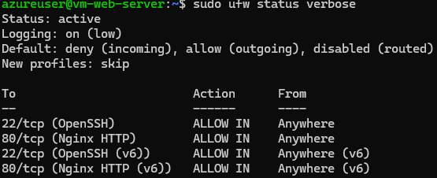

<h1>Azure Web Server Deployment & Hardening Project</h1>

<h2>Overview</h2>

My goal with this little project was to create a functional web server powered by Azure, in its most basic version, while ensuring its security and availability.

The project includes:

<ul>
  <li>VM creation and configuration</li>
  <li>Web server installation</li>
  <li>Hardening</li>
  <li>Screenshots</li>
</ul>

<h2>Architecture Overview</h2>

User (SSH) → Public IP → Azure NSG → VM (Ubuntu) → Nginx Web Server 
User (HTTP) → Public IP → Azure NSG → VM (Port 80)

Resources deployed:

<ul>
  <li>1 Ubuntu VM (Standard B2als v2)</li>
  <li>1 Network Security Group</li>
  <li>1 Public IP</li>
  <li>1 Virtual Network + Subnet</li>
  <li>UFW firewall on the VM</li>
</ul>

<h2>Key Steps</h2>

<h3>1. VM Creation</h3>
<ul>
  <li>Region: Norway East (allowed by Azure for Students)</li>
  <li>Size: Standard B2als v2 (2 vCPUs, 4 GB RAM)</li>
  <li>Authentication: SSH key pair generated during deployment</li>
  <li>Resource group created for clean organization</li>
</ul>

Details in: <code>setup/vm-creation.md</code>

<h3>2. Web Server Installation</h3>

Nginx was installed and configured as the main HTTP server.

<pre><code>sudo apt update
sudo apt -y install nginx
sudo systemctl start nginx
sudo systemctl enable nginx
</code></pre>

Custom index page deployed:

<pre><code>echo "&lt;h1&gt;Azure Web Server demo&lt;/h1&gt;&lt;p&gt;by Armand Lagoguey&lt;/p&gt;" &gt; /var/www/html/index.html
</code></pre>

Details in: <code>setup/web-server-installation.md</code>

<h3>3. Hardening</h3>

Security measures applied:

<ul>
  <li>SSH key–only authentication</li>
  <li>PasswordAuthentication disabled in sshd_config</li>
  <li>UFW firewall configured:
    <ul>
      <li>Allow OpenSSH</li>
      <li>Allow Nginx HTTP</li>
      <li>Deny all other inbound traffic</li>
    </ul>
  </li>
</ul>

<strong>Screenshot:</strong>

Details in: <code>setup/hardening.md</code>

<h3>4. Network Configuration</h3>

Azure NSG rules applied:

<ul>
  <li>Allow SSH (22) only from a single trusted IP</li>
  <li>Allow HTTP (80) from any source</li>
  <li>Deny all other inbound traffic</li>
</ul>

<strong>Screenshot:</strong>

<h2>Validation</h2>

<h3>SSH Access</h3>
<pre><code>ssh -i &lt;private_key&gt; azureuser@&lt;public_ip&gt;
</code></pre>

<h3>HTTP Response</h3>
<pre><code>curl -I http://&lt;public_ip&gt;
</code></pre>

Expected:

<pre><code>200 OK
</code></pre>

<h3>Web Page Rendering</h3>

<h2>Security Justification</h2>

<ul>
  <li>SSH keys prevent brute-force password attacks.</li>
  <li>Disabling password authentication removes a major attack vector.</li>
  <li>UFW provides host-level filtering in addition to Azure NSG (layered defense).</li>
  <li>Restricting SSH to a single IP enforces least privilege.</li>
  <li>Only port 80 is exposed publicly, minimizing the attack surface.</li>
</ul>

