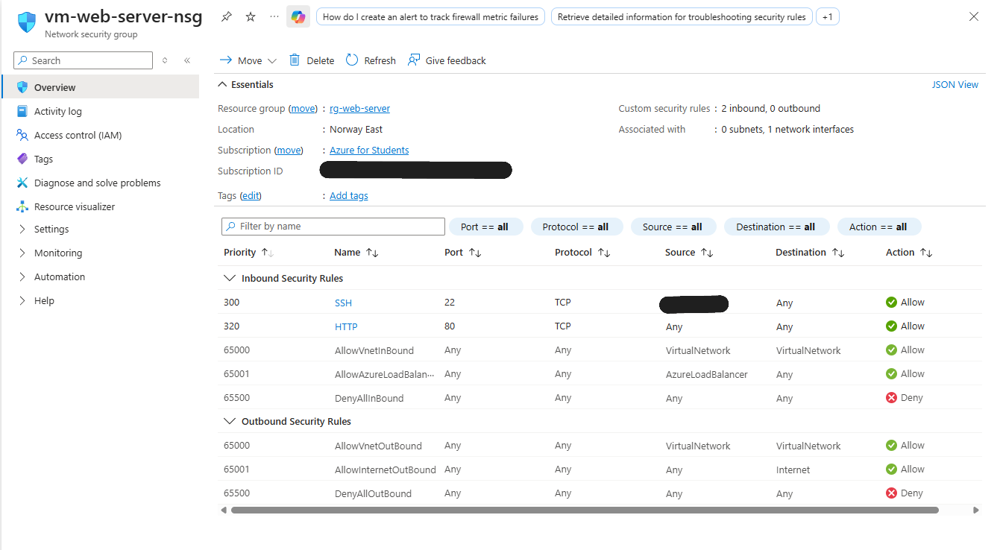
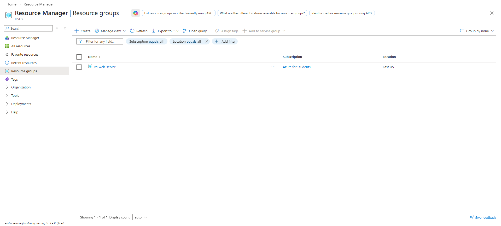
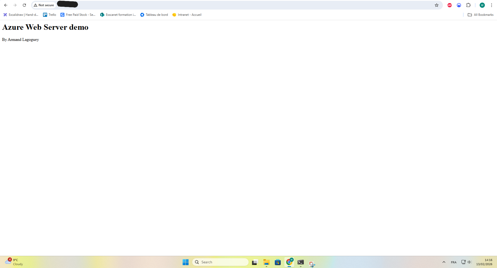

# VM Creation

## Overview
The goal here was to create a lightweight VM to host a simple web server for training purposes.

---

## Region Selection
I chose **Norway East** because it was in the list of allowed regions for the Azure Student subscription, and it offered the size options I wanted.

---

## VM Size
**Standard B2als v2**  
- 2 vCPUs  
- 4 GiB RAM  
- Cost efficient (about **$35 a month**)  
- Powerful enough for my purpose here

---

## Authentication
The VM uses **SSH key‑based authentication**.

- Authentication type: SSH public key  
- Key format: RSA  
- A new key pair was generated during deployment  
- The private key was securely stored locally  

---

## Networking
The VM was deployed with a public IP address to allow HTTP and SSH access.

A **Network Security Group (NSG)** was configured with the following inbound rules:

- Allow SSH (22) from a trusted IP only (mine)  
- Allow HTTP (80) from anywhere  
- Deny all other inbound traffic  

**Screenshot reference:**  

---

## Resource Group
All resources were deployed inside a dedicated resource group.

**Screenshot reference:**  

---

## Validation
After deployment, the VM was running, SSH access worked, and the web server was reachable.

**Screenshot references:**  

